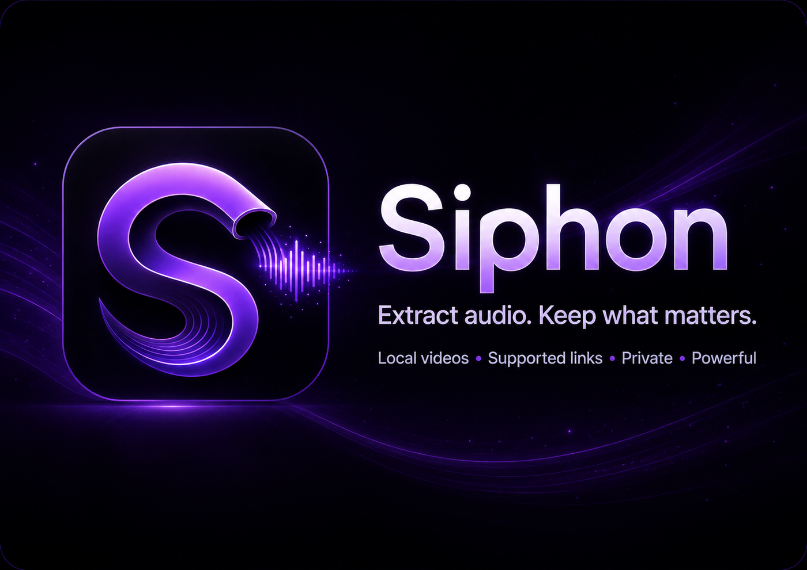

<p align="center">
  
</p>

<p align="center">
  <strong>Extract audio. Keep what matters.</strong><br>
  A focused Android audio extractor for local video and supported media links.
</p>

<p align="center">
  
  
  
  
  
</p>

---

## What is Siphon?

**Siphon** extracts audio from video without turning the job into a workflow project of its own. Pick a local video or share/paste a supported media link, choose how you want the audio handled, and let Siphon do the extraction in the background.

The app is built around a few simple priorities:

- **Local-first behavior** for local media.
- **Background resilience** for long extraction jobs.
- **Clear output control** instead of mystery conversions.
- **Android-native storage** through MediaStore.
- **Privacy-conscious handling** of cookies, paths, and extraction logs.
- **A UI that looks intentional** without getting in the way of the job.

> [!IMPORTANT]
> Siphon is currently a development build. The current development version is **`0.3-dev.5`** (`versionCode 7`). The latest stable line remains **`0.2.0`**.

## Highlights

| | Capability |
| --- | --- |
| 🎬 | **Local video extraction** from videos discovered through Android MediaStore |
| 🔗 | **Supported link extraction** from pasted URLs or Android's Share menu |
| 🎧 | **Multiple output formats** — original stream when possible, MP3, M4A/AAC, Opus, FLAC, and WAV |
| 🎚️ | **Quality control** for lossy output formats |
| 🏷️ | **Metadata tagging** for title, artist, album, album artist, genre, year, track, comment, and artwork |
| ⚙️ | **Foreground WorkManager jobs** so extraction can survive backgrounding |
| 🛑 | **Safe cancellation** without false success or duplicate exported output |
| 📁 | **Transactional MediaStore export** to `Music/Siphon` |
| 🕘 | **History + Library** for completed work and exported audio |
| 🧹 | **Storage cleanup** for abandoned staging and legacy private output |
| ⬆️ | **yt-dlp extractor maintenance** with stable and nightly update options |
| 🌑 | **OLED-first interface** with Siphon's violet visual identity |

## How it works

Siphon has two extraction paths that converge on the same verified export pipeline.

```text
Local video ──► file descriptor ──► FFmpeg ─────┐
                                                ├─► private staging ─► verified MediaStore export
Media link ───► yt-dlp ──────────► post-process ┘
```

### Local media

Local videos bypass yt-dlp. Scoped-storage content is read through a live file descriptor and passed directly to the bundled FFmpeg binary, avoiding a full source-video copy into app cache.

### Media links

Supported links are processed through yt-dlp. Siphon builds the extraction arguments for format, quality, metadata, cookies, extractor client, and post-processing before handing the job to the bundled runtime.

### Export safety

Both paths stage output privately first. Completed audio is written transactionally through MediaStore, verified, and only then is temporary private staging data removed.

## Interface

Siphon is organized into four focused sections:

- **Extract** — choose a local video or link, output format, quality, and metadata options.
- **History** — review completed, failed, and cancelled jobs.
- **Library** — open successfully exported audio.
- **Settings** — extractor maintenance, storage cleanup, app information, and supporting controls.

The application uses a deliberately dark OLED-oriented interface with violet identity accents and adaptive/themed launcher artwork.

## Requirements

- Android 8.0+ (`minSdk 26`)
- `arm64-v8a` device for the current APK configuration
- Android Studio with JDK 17+ support, or JDK 17+ for command-line builds

### Current build stack

| Component | Version |
| --- | --- |
| Android Gradle Plugin | `8.7.2` |
| Gradle | `8.9` |
| Kotlin | `2.0.21` |
| Jetpack Compose BOM | `2024.10.01` |
| compileSdk | `35` |
| targetSdk | `35` |
| Java/Kotlin target | `17` |

## Build from source

The standard Gradle wrapper is checked into the repository and is the canonical build entry point.

### Windows

```powershell
.\gradlew.bat assembleDebug
```

### Linux / macOS

```bash
./gradlew assembleDebug
```

### Unit tests

```powershell
.\gradlew.bat testDebugUnitTest
```

or:

```bash
./gradlew testDebugUnitTest
```

### Release compilation

```powershell
.\gradlew.bat assembleRelease
```

Release signing and publishing are intentionally separate from compilation. APKs, AABs, signing material, local SDK configuration, IDE state, and build output do **not** belong in source history.

> [!NOTE]
> The current Gradle configuration builds only `arm64-v8a` to keep the package manageable with the bundled Python and FFmpeg runtime. Additional ABIs must be explicitly enabled and tested in `app/build.gradle.kts`.

## Permissions

Siphon requests only permissions required by its current feature set:

| Permission | Why it is used |
| --- | --- |
| `INTERNET` | Link extraction and extractor updates |
| `ACCESS_NETWORK_STATE` | Network-aware operations |
| `READ_MEDIA_VIDEO` | Local video discovery on Android 13+ |
| `READ_EXTERNAL_STORAGE` | Local video access on Android 12L and older |
| `WRITE_EXTERNAL_STORAGE` | Shared Music export on Android 8/9 only |
| `FOREGROUND_SERVICE` | Long-running extraction |
| `FOREGROUND_SERVICE_DATA_SYNC` | Android foreground-service classification for extraction work |
| `POST_NOTIFICATIONS` | Foreground extraction status where Android requires it |

## Extractor updates and cookies

Websites change frequently, so the yt-dlp data bundled with an app release can become stale while Siphon itself remains healthy.

Use **Settings → Update extractor** to install the current stable yt-dlp data. A nightly option is available for newer site fixes, with the usual increased regression risk of nightly software.

For authenticated sites, Siphon can import a Netscape-format `cookies.txt`. Cookie data is stored in app-private storage, and extraction diagnostics are designed to avoid exposing private cookie paths and source URLs.

Some services may still require authentication or anti-bot mechanisms that cannot be satisfied on-device. Those failures are upstream/site limitations and do not imply a problem with local-video extraction.

## Application updates

The **extractor updater** and the future **Siphon application updater** are intentionally separate systems.

The application updater has not been enabled yet. When implemented, it will follow the shared Typezer∅ release/update standard derived from the CouchLink updater work: channel-aware manifests, exact version handling, SHA-256 verification, signing-certificate verification, safe private downloads, Android's package-installer confirmation, downgrade protection, and failure-safe behavior.

See [the updater plan](docs/UPDATER-PLAN.md) and [release guidance](docs/RELEASES.md).

## Project structure

```text
app/
  src/main/java/com/typezero/siphon/
    data/        MediaStore access and data models
    di/          lightweight application container
    engine/      yt-dlp, FFmpeg, cookies, output resolution
    ui/          Jetpack Compose UI and ViewModel
    work/        foreground WorkManager extraction
  src/test/      extraction argument unit tests

docs/
  assets/branding/
    siphon-header.png
    siphon-icon.png
  RELEASES.md
  UPDATER-PLAN.md

.github/
  workflows/     GitHub Actions verification
  ISSUE_TEMPLATE/
```

## Contributing

Bug reports and focused pull requests are welcome. Start with [`CONTRIBUTING.md`](CONTRIBUTING.md), and please use the supplied issue templates when reporting reproducible problems.

Security-sensitive reports should **not** be posted as public issues. See [`SECURITY.md`](SECURITY.md).

## Repository and release policy

- Source code and documentation belong in Git.
- Generated APK/AAB files belong in GitHub/Forgejo Releases, not commits.
- Signing keys, keystores, tokens, cookies, SDK paths, caches, and IDE-local state must never be committed.
- The checked-in Gradle wrapper is the canonical command-line build entry point.
- Public release artifacts should include checksums and release notes.
- The application updater must consume release metadata produced under the shared Typezer∅ release rules rather than inventing a Siphon-only format.

## License

Siphon's original source code is available under the **Apache License 2.0**. See [`LICENSE`](LICENSE) and [`NOTICE`](NOTICE).

Siphon also depends on and may distribute third-party components under their own licenses. The Apache-2.0 license for Siphon's original source does **not** replace or override those upstream terms. The current extraction stack includes GPL-licensed components, so binary redistribution has additional obligations.

Read [`THIRD_PARTY_NOTICES.md`](THIRD_PARTY_NOTICES.md) before distributing an APK.

## Responsible use

Siphon is a media utility, not a permission bypass. Only extract or convert media that you own or otherwise have permission or legal authority to use.

---

<p align="center">
  <br>
  <sub>Built with Kotlin, Jetpack Compose, yt-dlp, and FFmpeg.</sub>
</p>
